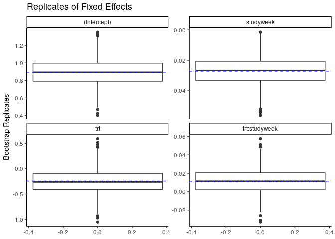

glmmBoot
================

`glmmBoot` consists of a series of tools that for fitting and
bootstrapping generalized linear mixed models (GLMMs) that takes
advantage of the Template Model Builder (`TMB`), built on`CppAD` and
`Eigen`.

At this stage of development it can handle Mixed Logit and Mixed Poisson
Models, yet it has the potential of being extended intended to handle a
wide range of statistical distributions. Fixed and random effects models
can be specified for the conditional and zero-inflated components of the
model, as well as fixed effects models for the dispersion parameter.

# Mixed Poisson Example

This code to illustrates the implementation of the bootstrapping methods
described in [(Flores-Agreda and Cantoni, Under
Review)](https://www.researchgate.net/publication/315768128_Bootstrapping_Generalized_Linear_Mixed_Models_via_a_Weighted_Laplace_Approximation)
in a real-data context. Data comes from the  example found in
[Molenberghs & Verbeke
(2006)](https://www.springer.com/gp/book/9780387251448) initially
reported by [Faught et. al.
(1996)](https://www.ncbi.nlm.nih.gov/pubmed/8649570).

## Model

The aim of the study was to verify the effects of an new anti-epileptic
drug (AED) compared to a placebo on the number of seizures experienced
by patients during the study. To do this, consider a mixed Poisson model
for the outcome containing two potentially correlated random effects:
one for a random intercept and another one for the visit time i.e.


where:

  -  represents the
    effect of the treatment and
  -  the visit time.

The variance-covariance structure of the vector of Normal random effects
 , comprises a
correlation coefficient 
, i.e.


## Analysis

To start performing the analysis, you need:

1.  the following packages:

<!-- end list -->

``` r
library(lme4)
library(glmmTMB)
library(sas7bdat)
library(TMB)
library(dplyr)
library(ggplot2)
library(kableExtra)
```

2.  to compile `glmm_rirs.cpp` and load the resulting binary into the
    environment:

<!-- end list -->

``` r
compile(file = "glmmBoot/src/glmm_rirs.cpp")
```

    ## [1] 0

``` r
dyn.load(dynlib("glmmBoot/src/glmm_rirs"))
```

3.  the functions in the file `glmmBoot.R`:

<!-- end list -->

``` r
source("glmmBoot/R/glmmBoot.R")
```

4.  the dataset `epilepsy.sas7bdat`

<!-- end list -->

``` r
epilepsy <- read.sas7bdat(file = "glmmBoot/data/epilepsy.sas7bdat")
```

## Implementation

### `estimate_glmm()`

The function `estimate_glmm()` estimates the model with a `TMB` template
using the frame and estimates of objects of class `glmerMod` as starting
values. For example:

``` r
obj.glmerMod <- lme4::glmer(nseizw~ trt*studyweek + (studyweek|id), 
                            family = "poisson",
                            data = epilepsy, 
                            control = glmerControl(optimizer = "bobyqa"))
```

for comparison purposes, let us also extract the estimates of this
object

A comparison of the estimates yields:

``` r
est_lmer %>% 
  inner_join(est_tmb, by=("Parameters"), suffix=c(" (glmer)", " (TMB)")) 
```

    ##      Parameters Estimates (glmer) Std..Errors (glmer) Estimates (TMB)
    ## 1   (Intercept)        0.89447741         0.178194833      0.89448617
    ## 2           trt       -0.24422209         0.253813668     -0.24430762
    ## 3     studyweek       -0.02714089         0.009853978     -0.02714543
    ## 4 trt:studyweek        0.01067076         0.013847317      0.01067175
    ## 5           s_1        1.12722970                  NA      1.12726849
    ## 6           s_2        0.04871389                  NA      0.04871498
    ## 7           rho       -0.33394327                  NA     -0.33387552
    ##   Std..Errors (TMB)
    ## 1       0.178577425
    ## 2       0.254353981
    ## 3       0.009920940
    ## 4       0.013933245
    ## 5       0.097487567
    ## 6       0.005702092
    ## 7       0.131163679

The generation of replicates using Random Weighted Laplace Bootstrap
[(Flores-Agreda and Cantoni, Under
Review)](https://www.researchgate.net/publication/315768128_Bootstrapping_Generalized_Linear_Mixed_Models_via_a_Weighted_Laplace_Approximation)
is carried by the function `bootstrap_glmm()`, with the option
`method=rwlb`.

``` r
## Bootstrap inference 
rwlb_reps <- bootstrap_glmm(obj.glmerMod,
                            B = 1000,
                            method = "rwlb")
```

    ## Bootstrap Replicates via RWLB

    ## Progress: =                   5%

    ## Progress: ==                  10%

    ## Progress: ===                 15%

    ## Progress: ====                20%

    ## Progress: =====               25%

    ## Progress: ======              30%

    ## Progress: =======             35%

    ## Progress: ========            40%

    ## Progress: =========           45%

    ## Progress: ==========          50%

    ## Progress: ===========         55%

    ## Progress: ============        60%

    ## Progress: =============       65%

    ## Progress: ==============      70%

    ## Progress: ===============     75%

    ## Progress: ================    80%

    ## Progress: =================   85%

    ## Progress: ==================  90%

    ## Progress: =================== 95%

    ## Progress: ====================100%

The resulting Bootstrap replicates are stored in an object of the class
`glmmBoot`, which can be used to construct

  - Estimates of the Parameters: by averaging over the replicates
  - Estimates of the Standard Errors: by computing the standard
    deviations for the replicates and
  - Percentile-based Confidence Intervals (CI) with a level of 95%.

## Methods

### `confint()`

produces bootstrap estimates, standard errors and confidence intervals
with the `percentile` and `studentized` methods

  - Example of the percentile method

<!-- end list -->

``` r
rwlb_reps %>% 
  confint(bootstrap_type = "percentile")
```

    ## # A tibble: 7 x 5
    ##   Parameters    Estimate Std_Errors ci_lower ci_upper
    ##   <fct>            <dbl>      <dbl>    <dbl>    <dbl>
    ## 1 (Intercept)     0.896     0.155     0.591   1.21   
    ## 2 rho            -0.321     0.164    -0.639  -0.00273
    ## 3 s_1             1.12      0.126     0.906   1.41   
    ## 4 s_2             0.0475    0.00719   0.0339  0.0622 
    ## 5 studyweek      -0.0271    0.00903  -0.0451 -0.00988
    ## 6 trt            -0.253     0.249    -0.716   0.249  
    ## 7 trt:studyweek   0.0114    0.0138   -0.0170  0.0396

  - Example of the studentized method

<!-- end list -->

``` r
rwlb_reps %>% 
  confint(bootstrap_type = "studentized")
```

    ## # A tibble: 7 x 5
    ##   Parameters    Estimate Std_Errors ci_lower ci_upper
    ##   <fct>            <dbl>      <dbl>    <dbl>    <dbl>
    ## 1 (Intercept)     0.896     0.155     0.592   1.21   
    ## 2 rho            -0.321     0.164    -0.760  -0.0638 
    ## 3 s_1             1.12      0.126     0.856   1.34   
    ## 4 s_2             0.0475    0.00719   0.0321  0.0603 
    ## 5 studyweek      -0.0271    0.00903  -0.0445 -0.00794
    ## 6 trt            -0.253     0.249    -0.740   0.258  
    ## 7 trt:studyweek   0.0114    0.0138   -0.0160  0.0395

### `plot()`

Shows the boxplots of the replicates for all the parameters or a subset
with a line describing the TMB estimates

  - fixed effect parameters

<!-- end list -->

``` r
plot(rwlb_reps, 
     parm_subset=c("(Intercept)", "trt", "studyweek", "trt:studyweek")) + 
  ggtitle("Replicates of Fixed Effects") +
  theme_classic()
```

<!-- -->

  - variances of random effects

<!-- end list -->

``` r
plot(rwlb_reps, 
     parm_subset=c("s_1", "s_2", "rho")) + 
  ggtitle("Replicates of Variance Components")+theme_classic()
```

<!-- -->
